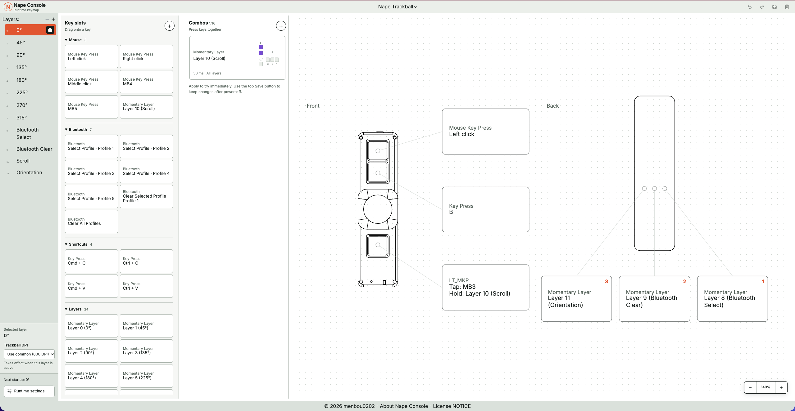
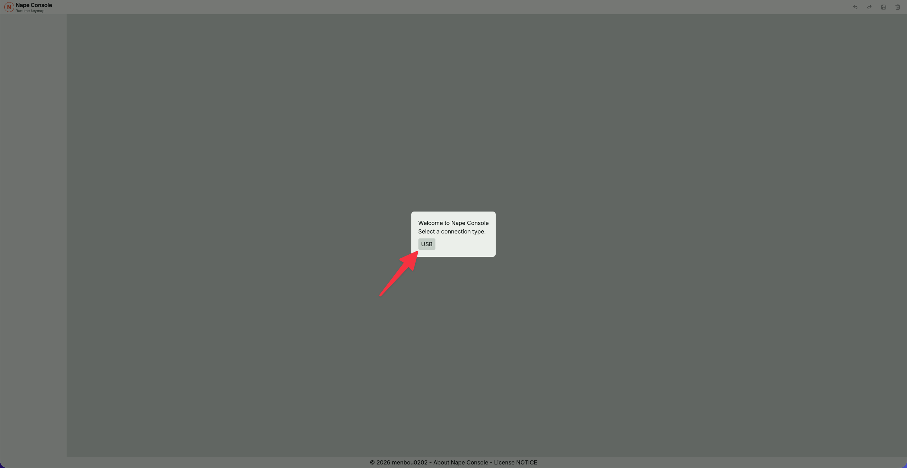
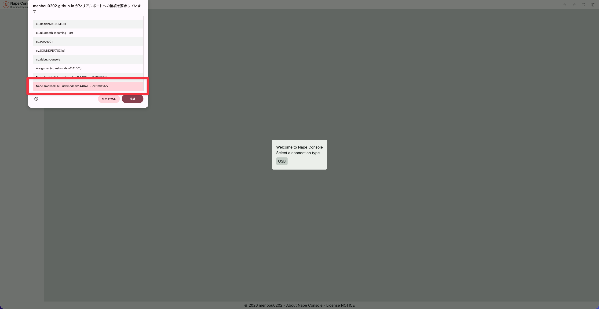
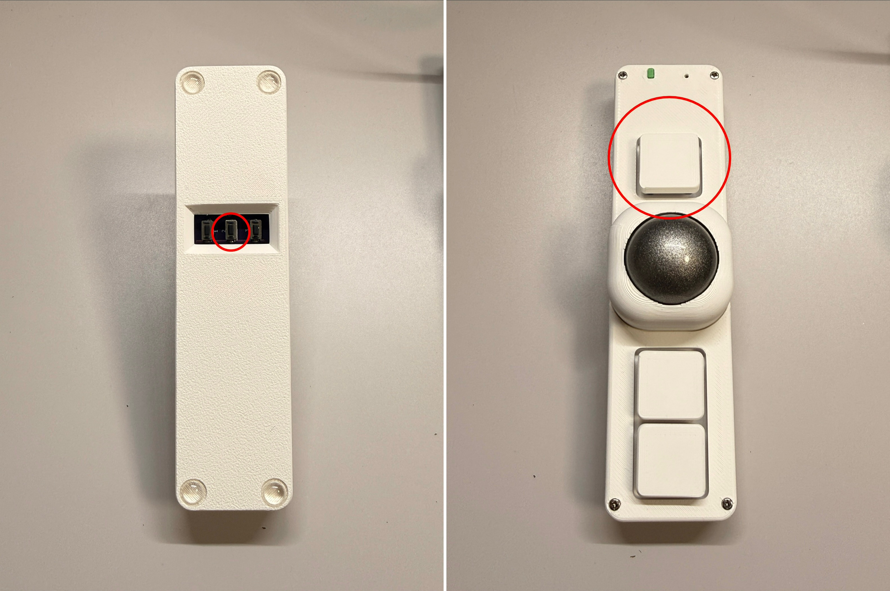
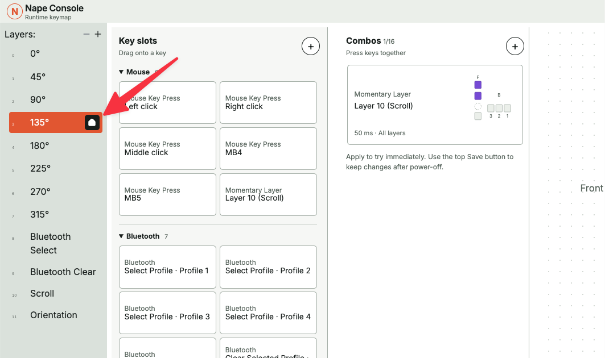
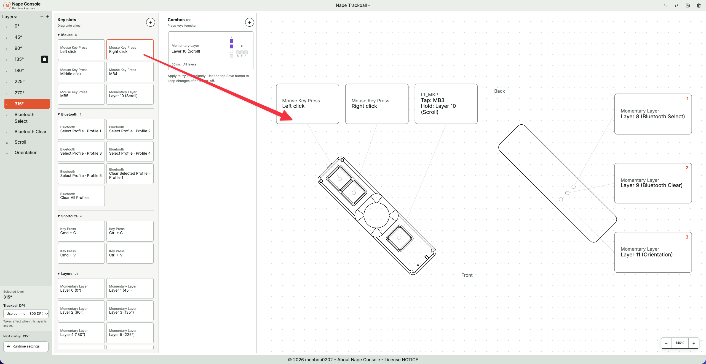
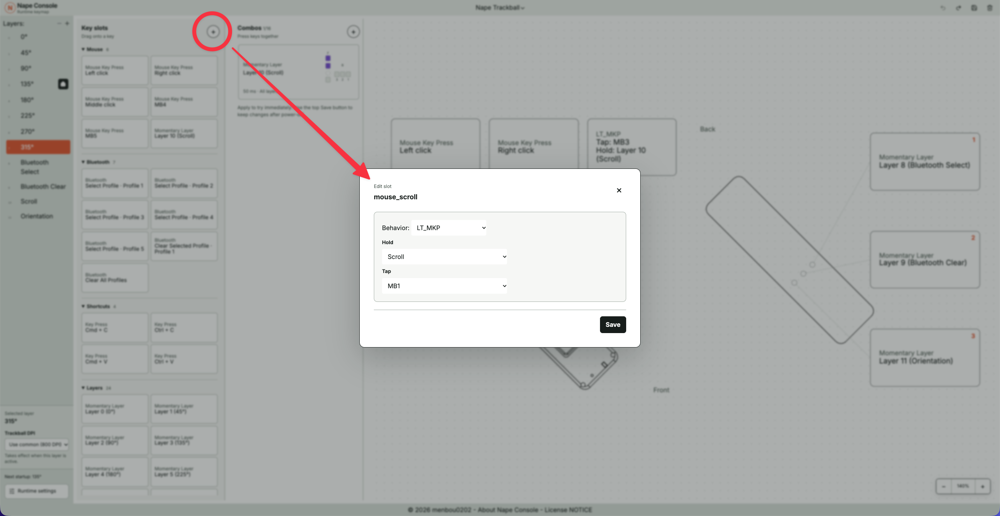
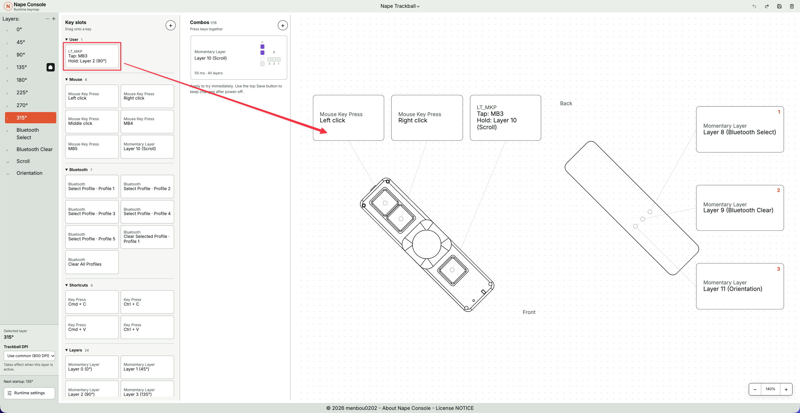
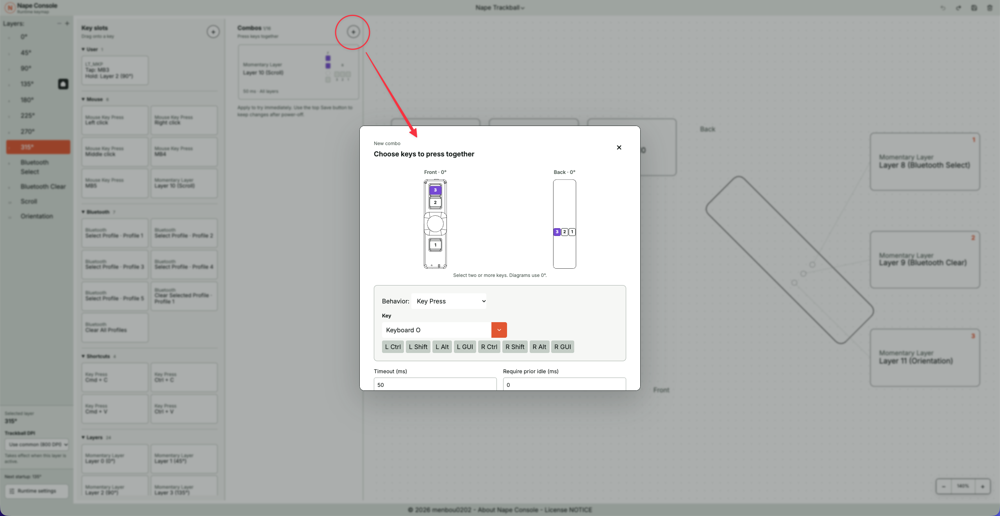
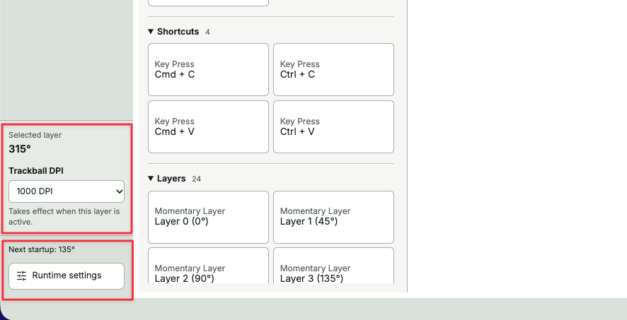

# Nape Consoleの使い方：キーマップを変更する

Nape Consoleは、Napeのキー割り当てをブラウザーから変更するツールです。最初に対応ファームウェアを書き込めば、以後のキーマップ変更にファームウェアの再ビルド・再書き込みは必要ありません。

このガイドはデスクトップ版Chrome／EdgeとUSB接続を対象にしています。スマートフォンのブラウザーやBluetooth経由の設定には対応していません。

## 準備するもの

- Nape本体と、データ通信ができるUSBケーブル
- デスクトップ版ChromeまたはEdge
- Nape Console対応の`nape-console.uf2`を書き込んだNape

対応UF2は[Nape Console β1 Release](https://github.com/menbou0202/zmk-config-nape/releases/tag/nape-console-beta.1)から`nape-console.uf2`をダウンロードしてください。自分でビルドしたい場合は、[`zmk-config-nape`の`console-beta`ブランチ](https://github.com/menbou0202/zmk-config-nape/tree/console-beta)を使えます。

UF2の書き込み方法は[Napeの組み立てガイド](https://github.com/menbou0202/Nape/blob/main/doc/build-guide.md)を参照してください。

## Napeを接続してUnlockする

1. [Nape Console](https://menbou0202.github.io/nape-console/)を開きます。
2. NapeをUSBケーブルでパソコンへ接続します。
3. 画面の「USB」を押し、ブラウザーの接続確認画面でNapeのポートを選んで接続します。

   

   

4. 「Unlock To Continue」と表示されたら、Nape本体のStudio Unlockキーを押します。

   

デフォルトのConsole版キーマップでは、**裏面Key2を押したまま、表面Key1を押す**とUnlockできます。

## レイヤーについて

左端の「Layers」から編集するレイヤーを選びます。0〜7はNapeの向きに対応し、選んだ角度に合わせて中央のNape図も回転します。8はBluetooth Select、9はBluetooth Clear、10はScroll、11はOrientationです。

レイヤー0〜11はNapeの基本動作に使うため削除や並べ替えはできません。新しい用途のレイヤーが必要なら、Layersの「＋」で12以降を追加できます。追加したレイヤーを削除するには、そのレイヤーを選んでLayersの「−」を押します。

Layersの0〜7に表示される家のアイコンをクリックしてオンにすると、そのレイヤーが起動時にオンになるレイヤーとして設定されます。設定後に画面右上の「Save」を押してください。実際に起動時の向きが変わるのは、Napeを再起動した後です。

## キーの割り当てを変える

最も簡単なのは、左の「Key slots」から使いたい動作を探し、右側のキーマップへドラッグ＆ドロップする方法です。Mouse、Bluetooth、Shortcuts、Layersには、よく使う動作があらかじめ用意されています。ドロップするとキーマップの表示も新しい動作に変わります。

用意されていない動作は、Key slotsの「＋」でUserスロットを作れます。Behavior（動作の種類）を選び、必要なキー・レイヤーなどを設定して、**スロット編集画面の「Save」**を押してください。作ったスロットは左のUserカテゴリに入り、そのブラウザーに保存されます。キーへ割り当てるには、作成したスロットをキーマップへドラッグします。

キーマップを直接クリックして、割り当てだけを変更することもできます。この方法で編集しても、元のスロットには影響しません。

よく使うBehaviorの例：

| 画面の名前 | 動作 |
| --- | --- |
| Key Press | キーボードのキーを入力する |
| Mouse Key Press | マウスボタンを押す |
| Momentary Layer | 押している間だけ別レイヤーを使う |
| To Layer | 指定したレイヤーへ切り替える |
| Mod-Tap | 短押しでキー入力、長押しで修飾キーを使う |
| Layer-Tap | 短押しでキー入力、長押しで別レイヤーを使う |

## 保存する

キーの変更はすぐにNapeで試せます。ただし、**電源を切った後も残すには、画面右上のフロッピーディスク形の「Save」を押す必要があります。** Userスロットの編集画面にある「Save」とは別です。

保存前なら、画面右上のUndo／Redoで編集を戻したり、ゴミ箱形の「Discard」で未保存の変更を破棄したりできます。保存したらUSBをつなぎ直し、割り当てが残っているか確認してください。

## Combo

「Combos」では、2つ以上のキーを同時に押したときの動作を編集できます。「＋」で押すキー、実行するBehavior、同時押しの待ち時間などを設定して「Apply」を押します。これも電源断後に残すには、最後に画面右上の「Save」が必要です。

## その他細かい設定

画面左下のエリアでは下記の設定が可能です。

- Trackball DPI：レイヤーごとのDPI設定
- Runtime settings：Tapping-Termなどの細かい数値設定

Nape Consoleは[ZMK Studio](https://github.com/zmkfirmware/zmk-studio)を基にしています。Nape固有の機能や操作について不明な点は、[Nape ConsoleのIssue](https://github.com/menbou0202/nape-console/issues)でお知らせください。
